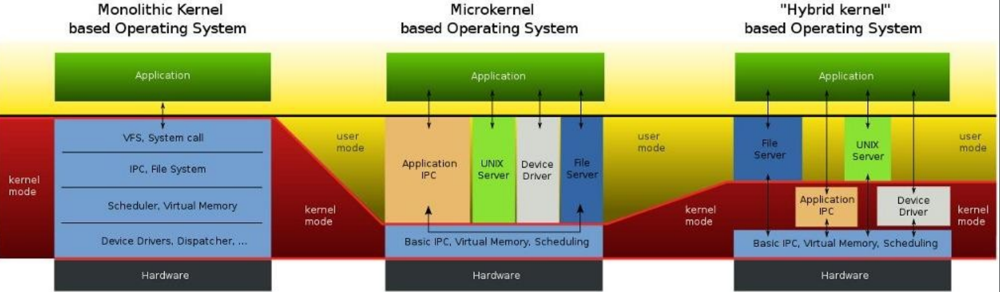

# Actividad 1

## Tipos de kernel

* **kernel Monolitico**: Estos sistemas tienen un núcleo grande y complejo que engloba todos los servicios del sistema, está programado de forma no modular, y tiene un rendimiento mayor que un micronúcleo, sin embargo, cualquier cambio a realizar en cualquier servicio requiere la recompilación del núcleo y el reinicio del sistema para aplicar los nuevos cambios.

* **Micro-kernel**: Son núcleos de pequeño tamaño que fueron compilados sólo con las necesidades más básicas del sistema operativo, el resto de funcionalidades son añadidas mediante la adición de módulos externos al núcleo, lo que les proporciona flexibilidad y facilidad de ampliación, son mas seguros que los Monolíticos.

* **Kernel Hibridos**: Es una arquitectura basada en la combinación de microkernel y núcleo monolítico, estas arquitecturas son utilizadas dentro de las computadoras por medio de los sistemas operativos, una característica especial con que cuenta el núcleo híbrido es que incluyen código extra con el objetivo de mejorar el rendimiento.

## Diferencias en los tipos de kernel

* **Kernel Monolitico**:
    * Características:
        * Todas las funciones en un solo núcleo.
        * Acceso directo a estructuras de datos del núcleo.
    * Ventajas:
        * Eficiencia en la comunicación interna.
        * Rendimiento aceptable en sistemas estables.
    * Desventajas:
        * Mayor riesgo de fallos que afecten al sistema completo.
        * Complejidad para cambios o actualizaciones.
    * Ejemplos:
        * Linux
        * Versiones antiguas de Windows.
* **Kernel Microkernel**:
    * Características:
        * Funciones esenciales en el núcleo, resto en espacio usuario.
        * Comunicación entre servidores y núcleo mediante IPC (Inter-Process * Communication).
    * Ventajas:
        * Mayor estabilidad y fiabilidad.
        * Flexibilidad para agregar o modificar servicios sin alterar el núcleo.
    * Desventajas:
        * Mayor sobrecarga por comunicación IPC.
        * Menor rendimiento en ciertas aplicaciones.
    * Ejemplos:
        * MINIX
        * QNX.
* **Kernel Hibrido**:
    * Características:
        * Combinación de elementos monolíticos y microkernel.
        * Funciones esenciales en el núcleo; otras en espacio usuario.
    * Ventajas:
        * Equilibrio entre rendimiento y estabilidad.
        * Rendimiento aceptable y flexibilidad.
    * Desventajas:
        * Mayor complejidad de diseño y desarrollo.
    * Ejemplos:
        * Windows NT
        * macOS.

## Tipo de kernel de linux

Utiliza un kernel monolitico, todas las funciones y servicios del sistema operativo están integrados en un solo núcleo, lo que permite una alta eficiencia en la comunicación interna entre los componentes del kernel, este es responsable de la gestión de procesos, la administración de memoria, la gestión del sistema de archivos, la comunicación con dispositivos de hardware y otras funciones esenciales del sistema operativo.

## User vs Kernel mode

* **User**:

    * En el modo usuario, los programas y aplicaciones se ejecutan con privilegios limitados y tienen acceso restringido a ciertas partes del sistema.
    * Las aplicaciones en el modo usuario solo pueden acceder a recursos permitidos y no pueden realizar operaciones críticas o manipular directamente el hardware.
    * El modo usuario proporciona una capa de protección para evitar que las aplicaciones dañen o interfieran con otras partes del sistema o con el propio núcleo.
    * Cuando una aplicación necesita acceder a recursos más privilegiados o realizar operaciones de nivel inferior, debe solicitar estos servicios al kernel del sistema operativo a través de llamadas de sistema (system calls).

* **Kernel mode**:

    * En el modo núcleo, el kernel del sistema operativo se ejecuta con el nivel más alto de privilegios y tiene acceso completo a todos los recursos del sistema, incluidos el hardware y las funciones críticas del núcleo.
    * El kernel tiene el control total del sistema y es responsable de gestionar los recursos, la planificación de procesos, la administración de memoria y el acceso a los dispositivos de hardware.
    * Las operaciones que requieren acceso a recursos privilegiados, como el acceso directo al hardware o la modificación de estructuras del núcleo, solo pueden ser realizadas por el kernel en modo núcleo.
    * El modo núcleo se considera peligroso, ya que un error o comportamiento incorrecto en el kernel podría afectar la estabilidad y seguridad del sistema en su totalidad.

## Forma visual

