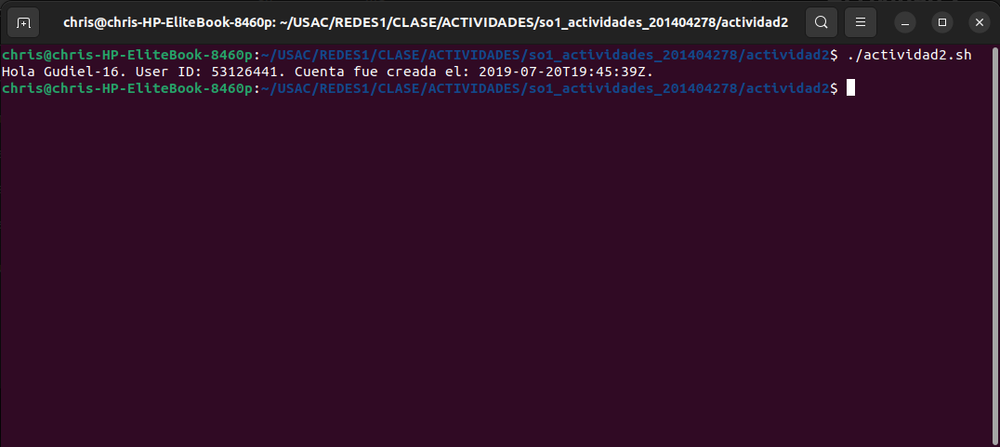
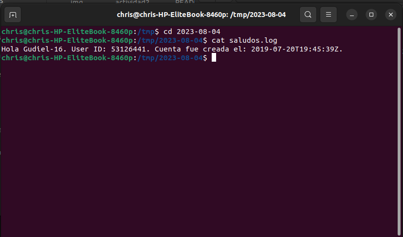

# Actividad 2

## Ejecutar script

* Abrir consola en directorio del archivo .sh.
* Dar permisos:

```bash
chmod +x actividad2.sh
```

* Ejecutar:

```bash
./actividad2.sh
```

## Ejecutar con un cronjob

* Ejecutar:
    * Elegir el editor favorito para editar.

```bash
crontab -e
```

* Agregar para que se ejecute cada 5 minutos:

```
*/5 * * * * /home/chris/USAC/REDES1/CLASE/ACTIVIDADES/so1_actividades_201404278/actividad2/actividad2.sh
```

* Ver contenido actual de crontab:

```bash
crontab -l
```

* ELiminar todas las entradas de cronjobs:

```bash
crontab -r
```

## Vista mensaje:



## Vista file log:

