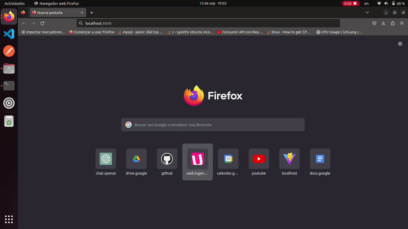

# Basic Budget Application
A basic budget javascript application using reacjs, express and Oracle Database.

## Get started

``` bash
docker compose up --build
```

## Solucion bug 404 not found al recargar pagina

* Se agrego el archivo **nginx.conf** en la raiz del frontend, con el siguiente contenido:

```nginx
server_tokens off;
server {
    listen       80;
    server_name  localhost;
    location / {
        root   /usr/share/nginx/html;
        index  index.html index.htm;
        try_files $uri /index.html;
    }
}
```

* Se modifico el archivo **nginx.dockerfile**, agregando la siguiente linea:

```docker
COPY nginx.conf /etc/nginx/conf.d/default.conf
```

* Resultado:

